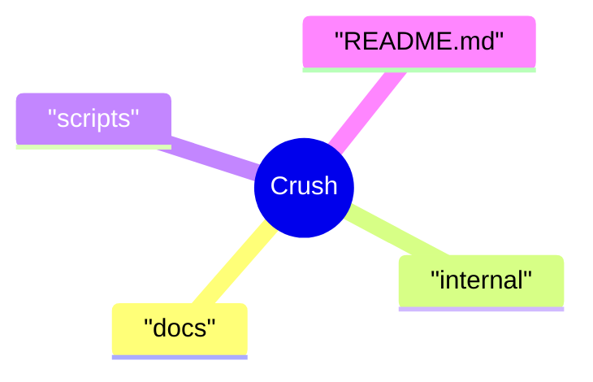

# Crush

Local fork of Charm’s terminal coding assistant. Upstream source and attribution are retained.

Local fork. Upstream authorship and licensing remain in force.

Upstream: [charmbracelet/crush](https://github.com/charmbracelet/crush). This repository is a local fork, not an original implementation by Mcddy.

## Source map

Source index from the current default branch. Folder names show organisation, not verified runtime behaviour.

## Upstream documentation

[Read the original upstream README](UPSTREAM_README.md) for installation, configuration, features, contributors and licence references. It is preserved as upstream documentation.

## Local changes

This presentation review did not establish a separately maintained feature set or a running local deployment. Use the commit history and pull requests to inspect differences from upstream.
